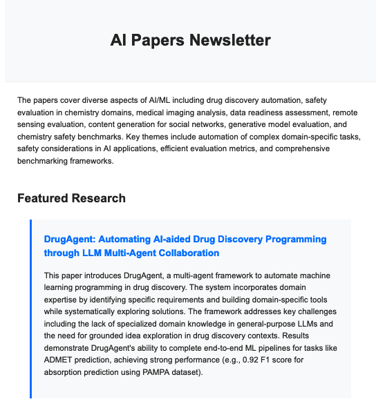
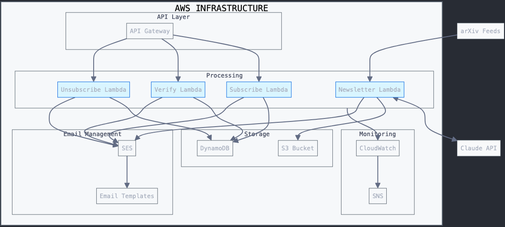

# AI Research Paper Newsletter

Automatically generates and sends newsletters about AI research papers using AWS Lambda and Claude. Create your own prompts that fit your desired use case.

[Sign up here](https://wesleypasfield.com/aipapers/) for  the original version.

Here's an [article](https://substack.com/home/post/p-152582033) I put together that walks through the full end-to-end building process.

## Features

- 🤖 Uses Claude to evaluate and summarize AI research papers
- 📊 Customizable paper evaluation criteria
- 📧 Automated email delivery via AWS SES
- ✅ Double opt-in subscriber management
- 📈 Built-in analytics and monitoring
- 🔄 Multi-LLM support with automatic fallback
- 🧠 DSPy integration for prompt optimization

Keep in mind there might be some required customization in your account, but this should get you really far along the way

## Newsletter Example

Below is an example of the newsletter final output:



## Architecture

The system consists of several key components:
- Paper Analyzer: Evaluates papers using Claude
- Newsletter Generator: Creates formatted newsletters
- Email Management: Handles subscriptions and delivery
- Monitoring: Tracks delivery and engagement metrics
- Multi-LLM Manager: Handles multiple LLM providers with fallback



## Prerequisites

- AWS Account with SES in production mode
- Anthropic API Key
- Python 3.11+
- AWS SAM CLI
- Verified SES sender email or domain

## Setup

1. **Configure AWS Credentials**
   ```bash
   aws configure
   ```

2. **Create Required Secrets**
   ```bash
   aws secretsmanager create-secret \
       --name anthropic/api_key \
       --secret-string '{"anthropic_key":"your-key-here"}'
   ```

3. **Configure Deployment**
   - Copy samconfig.example.toml to samconfig.toml
   - Update with your values
   ```bash
   cp samconfig.example.toml samconfig.toml
   # Edit samconfig.toml with your values
   ```

4. **Deploy Infrastructure**
   ```bash
   sam build
   sam deploy --guided
   ```

## Configuration

### Paper Evaluation

The system uses two key prompts that can be customized:

1. EVAL_PROMPT: Determines how papers are scored
2. NEWSLETTER_PROMPT: Controls newsletter formatting

Example evaluation criteria:
```python
EVAL_PROMPT = """
You are evaluating academic papers for an expert specializing in:
1. Practical LLM/Generative AI regulation
2. Societal and economic impacts
3. Technical implementation
...
"""
```

### Email Templates

Templates can be customized in the CloudFormation template:
- Verification Email
- Welcome Email
- Newsletter Template
- Unsubscribe Confirmation

## Multi-LLM Support

The system supports multiple LLM providers with automatic fallback:

### Current Providers
- **Claude (Anthropic)**: Primary provider with Claude 3 Haiku and Sonnet models
- **OpenAI**: Secondary provider with GPT-4o-mini and GPT-4o models

### Provider Configuration
```toml
# In samconfig.toml
PreferredLLMProvider="claude"  # or "openai"
```

### API Key Management
All API keys are stored securely in AWS Secrets Manager:
```bash
# Claude (already configured)
aws secretsmanager describe-secret --secret-id anthropic/api_key

# OpenAI (optional)
aws secretsmanager create-secret \
    --name openai_key \
    --secret-string '{"openai_key":"sk-your-key-here"}'
```

## Adding New LLM Providers

The system is designed to be easily extensible for new LLM providers. Here's how to add a new provider:

### Step 1: Create Provider Class

Create a new provider class in `functions/llm_providers.py`:

```python
class NewProvider(LLMProviderInterface):
    """New LLM Provider"""
    
    def __init__(self):
        self.client = None
        self._initialize_client()
    
    def _initialize_client(self):
        """Initialize client with API key from AWS Secrets Manager"""
        try:
            api_key = self._get_secret()
            if api_key:
                # Initialize your client here
                self.client = YourClient(api_key=api_key)
                logger.info("New provider client initialized successfully")
            else:
                logger.error("Failed to retrieve API key")
        except Exception as e:
            logger.error(f"Error initializing client: {str(e)}")
            self.client = None
    
    def _get_secret(self) -> Optional[str]:
        """Retrieve API key from AWS Secrets Manager"""
        try:
            secret_name = "newprovider/api_key"
            region_name = os.environ.get('AWS_REGION', 'us-west-2')
            
            session = boto3.session.Session()
            client = session.client(
                service_name='secretsmanager',
                region_name=region_name
            )

            get_secret_value_response = client.get_secret_value(SecretId=secret_name)
            
            if 'SecretString' in get_secret_value_response:
                secret = json.loads(get_secret_value_response['SecretString'])
                return secret.get('newprovider_key')
            
            return None
        except Exception as e:
            logger.debug(f"Secret not found in AWS: {str(e)}")
            return None
    
    def generate(self, system_prompt: str, user_prompt: str, config: LLMConfig) -> LLMResponse:
        """Generate response using new provider"""
        if not self.client:
            raise RuntimeError("Client not initialized")
        
        try:
            # Implement your provider's API call here
            response = self.client.generate(
                prompt=f"{system_prompt}\n\n{user_prompt}",
                max_tokens=config.max_tokens,
                temperature=config.temperature
            )
            
            return LLMResponse(
                content=response.text,
                provider=LLMProvider.NEWPROVIDER,
                model=config.model,
                tokens_used=response.usage.total_tokens if hasattr(response, 'usage') else None
            )
            
        except Exception as e:
            logger.error(f"API error: {str(e)}")
            raise
    
    def is_available(self) -> bool:
        """Check if provider is available"""
        return self.client is not None
```

### Step 2: Add Provider Enum

Add your provider to the `LLMProvider` enum:

```python
class LLMProvider(Enum):
    CLAUDE = "claude"
    OPENAI = "openai"
    NEWPROVIDER = "newprovider"  # Add your provider here
```

### Step 3: Update LLMManager

Add your provider to the `_initialize_providers` method:

```python
def _initialize_providers(self):
    """Initialize all available LLM providers"""
    # ... existing providers ...
    
    # Initialize New Provider
    new_provider = NewProvider()
    if new_provider.is_available():
        self.providers[LLMProvider.NEWPROVIDER] = new_provider
        self.provider_priority.append(LLMProvider.NEWPROVIDER)
        logger.info("New provider initialized and available")
```

### Step 4: Add Model Configurations

Add your provider's models to `DEFAULT_CONFIGS`:

```python
DEFAULT_CONFIGS = {
    # ... existing providers ...
    LLMProvider.NEWPROVIDER: {
        'cheap': LLMConfig(
            provider=LLMProvider.NEWPROVIDER,
            model="newprovider-fast",
            max_tokens=4,
            temperature=0.0
        ),
        'expensive': LLMConfig(
            provider=LLMProvider.NEWPROVIDER,
            model="newprovider-pro",
            max_tokens=8000,
            temperature=0.0
        )
    }
}
```

### Step 5: Update CloudFormation Template

Add Secrets Manager permissions in `template.yaml`:

```yaml
- Effect: Allow
  Action: 
    - "secretsmanager:GetSecretValue"
  Resource: 
    - !Sub "arn:aws:secretsmanager:${AWS::Region}:${AWS::AccountId}:secret:anthropic/api_key-*"
    - !Sub "arn:aws:secretsmanager:${AWS::Region}:${AWS::AccountId}:secret:openai_key-*"
    - !Sub "arn:aws:secretsmanager:${AWS::Region}:${AWS::AccountId}:secret:newprovider/api_key-*"
```

### Step 6: Update Configuration

Add your provider to the allowed values in `template.yaml`:

```yaml
PreferredLLMProvider:
  Type: String
  Default: "claude"
  AllowedValues:
    - claude
    - openai
    - newprovider  # Add your provider here
```

### Step 7: Update Newsletter Generator

Add your provider to the provider map in `functions/newsletter_generator.py`:

```python
provider_map = {
    'claude': LLMProvider.CLAUDE,
    'openai': LLMProvider.OPENAI,
    'newprovider': LLMProvider.NEWPROVIDER  # Add your provider here
}
```

### Step 8: Create AWS Secret

Create your API key secret in AWS Secrets Manager:

```bash
aws secretsmanager create-secret \
    --name newprovider/api_key \
    --secret-string '{"newprovider_key":"your-api-key-here"}'
```

### Step 9: Add Dependencies

Add your provider's Python package to `requirements.txt`:

```txt
newprovider-python-sdk==1.0.0
```

### Step 10: Test Your Provider

Create a test to verify your provider works:

```python
def test_new_provider():
    """Test new provider integration"""
    from functions.llm_providers import LLMManager, LLMProvider
    
    llm_manager = LLMManager()
    available_providers = llm_manager.get_available_providers()
    
    assert LLMProvider.NEWPROVIDER in available_providers
    print(f"✅ New provider available: {LLMProvider.NEWPROVIDER}")
```

### Step 11: Deploy

Deploy your changes:

```bash
sam build
sam deploy
```

## API Endpoints

The system exposes several REST endpoints:

- POST /subscribe: Subscribe new email
- GET /verify: Verify subscription
- GET /unsubscribe: Remove subscription

## Monitoring

Built-in CloudWatch dashboard provides metrics for:
- Email delivery rates
- Bounce/complaint rates
- Lambda execution metrics
- Paper processing statistics
- LLM provider usage and performance

## Development

### Adding New Features

1. Update SAM template
2. Add required Lambda functions
3. Update email templates if needed
4. Test locally
5. Deploy changes
6. Configure needed S3 resources for website hosting/landing page if interested

## Contributing

1. Fork the repository
2. Create a feature branch
3. Submit a pull request

## Security

Review the security checklist before deployment:
- SES domain verification
- API authentication
- IAM permissions
- Rate limiting
- CORS configuration
- Secrets Manager for API keys

## Testing

The `EmailTestMode` and `EmailTestAddress` parameters in the SamConfig enable testing. If the email test mode is sent to true, all emails will go to the email in the `EmailTestAddress` parameter. This enables making changes to the service without emailing the full subscriber base.

### Multi-LLM Testing

Test your LLM providers:

```bash
# Test all providers
python test_multi_llm.py

# Test specific provider
python -c "
from functions.llm_providers import LLMManager
llm = LLMManager()
print(f'Available providers: {llm.get_available_providers()}')
"
```

I definitely made some updates manually in the console, and had some resources already in my account so everything might not be perfectly smooth, particularly with DNS/SES